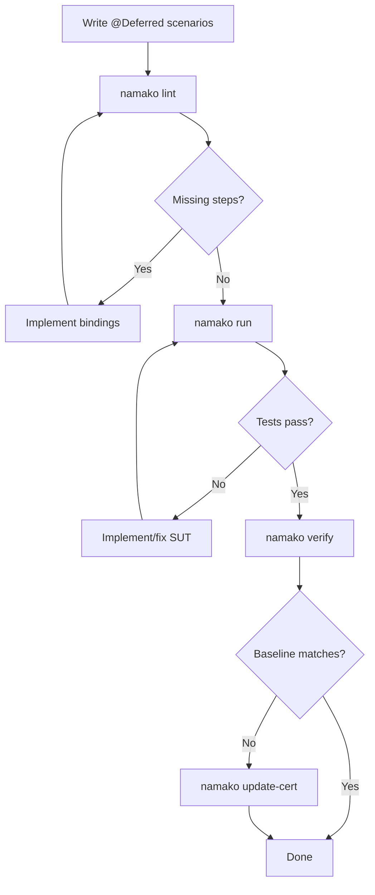

# NEXT_STEPS.md — Strategic Development Process for Spec-Driven AI Development

**Created:** 2026-01-19
**Author:** Architecture Review
**Purpose:** Define the optimal path forward for using Namako + Tesaki to drive autonomous spec-driven development

---

## Executive Assessment

### Where We Are

**Namako v1 is COMPLETE.** The toolchain is fully operational:

- ✅ 31 scenarios passing across 16 feature files
- ✅ All CLI commands implemented (`lint`, `verify`, `update-cert`, `status`, `review`, `explain`)
- ✅ Tesaki orchestrator generates deterministic NEXT_TASK.md
- ✅ CI gates green (namako_ci.sh, determinism_check.sh)
- ✅ All Bootstrap Exit Criteria satisfied

**V2+ features are deferred but designed-in.** The v1 foundation supports incremental adoption of hardening features without breaking changes.

### What's Next

The toolchain is ready for its intended purpose: **autonomous AI-driven development of Naia**. The transition from BOOTSTRAP to CONSUMPTION mode unlocks the ability to modify Naia core code through the Tesaki FSM.

---

## Recommended Development Process

### Phase 1: Consumption Mode Activation (Immediate)

**Goal:** Formally transition from BOOTSTRAP to CONSUMPTION mode and validate the end-to-end workflow with a controlled first mission.

#### Step 1.1: Mode Transition
1. Update `CURRENT_STATUS.md`: Set `MODE: CONSUMPTION`
2. Commit the transition as a clear milestone marker

#### Step 1.2: First CONSUMPTION Mission (Controlled)
Per GOLD_PLAN §2.7, select ONE CORE scenario to validate the workflow:

**Recommended First Mission Options:**
1. **Connection lifecycle edge case** — A well-bounded scenario in `01_connection_lifecycle.feature`
2. **Entity replication scenario** — Start fleshing out `07_entity_replication.feature`
3. **User-initiated error handling** — Add explicit Result::Err scenarios per `00_common.feature` Rule

**Mission Template:**
```
1. Select ONE scenario from feature files (or write a new @Deferred one)
2. Define minimal observable contract (what must become testable)
3. Run through Tesaki FSM:
   - namako lint (resolve steps)
   - Implement missing bindings
   - namako run (execute)
   - namako verify (certify)
   - namako update-cert (if approved)
4. Keep scope minimal — one scenario, one mission
```

#### Step 1.3: Validate Autonomous Loop
Run `tesaki next` with `--max-cert-updates 3` to verify:
- Promotion candidate selection works
- Binding bundle suggestions are useful
- NEXT_TASK.md provides actionable instructions

---

### Phase 2: Specification Expansion (Short-term)

**Goal:** Build out the Naia feature specifications incrementally, using the Tesaki loop to drive implementation.

#### Priority Order for Specification Work

| Priority | Feature File | Current State | Recommended Action |
|----------|--------------|---------------|-------------------|
| 1 | `01_connection_lifecycle.feature` | 14 scenarios | Expand edge cases, error handling |
| 2 | `00_common.feature` | 8 scenarios | Add Result::Err scenarios |
| 3 | `smoke.feature` | 9 scenarios | Baseline functional tests |
| 4 | `07_entity_replication.feature` | 0 scenarios | Write core replication specs |
| 5 | `06_entity_scopes.feature` | 0 scenarios | Write scope management specs |
| 6 | `08_entity_ownership.feature` | 0 scenarios | Write ownership transfer specs |

#### Workflow Per Feature



#### Incremental Expansion Strategy

1. **Start with @Deferred** — Write scenarios tagged `@Deferred` for new functionality
2. **Promote in small batches** — Untag 1-3 scenarios at a time
3. **Keep CI green** — Never break the gate between promotions
4. **Use Tesaki guidance** — Let `tesaki next` suggest what to work on

---

### Phase 3: Harness Maturation (Medium-term)

**Goal:** Strengthen the test harness to support more complex scenarios.

#### Harness Enhancements Needed

| Enhancement | Purpose | Complexity |
|-------------|---------|------------|
| Multi-client scenarios | Test N-client interactions | Medium |
| Timing control | Deterministic tick advancement | Low |
| State inspection | Rich assertion helpers | Low |
| Error injection | Test failure paths | Medium |
| Performance baselines | Non-functional requirements | High |

#### Implementation Pattern

For each harness enhancement:
1. Write a `.feature` scenario that requires the enhancement
2. Mark it `@Deferred @Blocker(HARNESS_ONLY)`
3. Implement harness capability
4. Promote scenario
5. Iterate

---

### Phase 4: Toolchain Polish (Medium-term)

**Goal:** Address v2+ features that provide the most value for AI-assisted development.

#### High-Value V2+ Features (Ranked by Impact)

| Feature | GOLD_PLAN Section | Value for AI Dev | Effort |
|---------|-------------------|------------------|--------|
| Rich `namako status` diffs | §11.10 | HIGH — Better error diagnostics | Low |
| Orphan binding warnings → errors | §11.3 | MEDIUM — Catch dead code | Low |
| Conformance fixtures | §11.8 | MEDIUM — Regression safety | Medium |
| FeatureAstNorm | §11.1 | LOW (v1 fingerprint sufficient) | High |
| Explicit ID tags | §11.2 | LOW (line-based keys work) | Medium |

**Recommended V2+ Roadmap:**
1. **§11.10: Rich status diffs** — Immediate value for debugging
2. **§11.3: Orphan warnings → errors** — Hygiene improvement
3. **Defer everything else** — v1 fingerprint and keys are sufficient

---

## Immediate Action Checklist

### For Connor (Human Operator)

- [ ] Review and commit the comprehensive `CURRENT_STATUS.md`
- [ ] Review and commit `NEXT_STEPS.md`
- [ ] Decide: Transition to CONSUMPTION mode? (recommended: yes)
- [ ] Select first CONSUMPTION mission target
- [ ] Run first mission through Tesaki FSM

### For AI Agent (Tesaki-Driven)

Once MODE = CONSUMPTION:
1. Run `tesaki next` to get current task
2. If no promotion candidates, suggest new @Deferred scenarios
3. Implement bindings for promoted scenarios
4. Iterate until gates green
5. Request update-cert approval when stable

---

## Success Metrics

### Short-term (Next 2 Weeks)

| Metric | Target |
|--------|--------|
| Executable scenarios | 40+ (from 31) |
| Feature files with scenarios | 6+ (from 3) |
| Autonomous tesaki cycles completed | 5+ |

### Medium-term (Next 2 Months)

| Metric | Target |
|--------|--------|
| Executable scenarios | 100+ |
| Feature coverage | All 16 feature files have scenarios |
| CORE blockers resolved | 5+ |

### Long-term (6 Months)

| Metric | Target |
|--------|--------|
| Naia core behaviors specified | 80%+ |
| CI cycle time | < 5 minutes |
| Agent autonomy | Tesaki can complete missions with minimal human intervention |

---

## Risk Mitigation

### Risk: Specification Drift
**Mitigation:** All specs in `.feature` files are normative. Markdown docs are reference only.

### Risk: Binding Proliferation
**Mitigation:** Regular orphan checks (`namako review` flags unused bindings).

### Risk: Hash Contract Changes
**Mitigation:** `hash_contract_version` enables controlled migrations. Never modify hashing rules without version bump.

### Risk: Agent Edit Surface Violations
**Mitigation:** `SYSTEM.md` enforces BOOTSTRAP/CONSUMPTION boundaries. Violations require revert + incident log.

### Risk: Certification Baseline Corruption
**Mitigation:**
- `update-cert` has refusal rules (must pass verify first)
- Tesaki governance (`--max-cert-updates`) limits autonomous updates
- Audit log tracks all baseline changes

---

## Conclusion

The Namako + Tesaki toolchain is operational and ready for production use. The v1 KISS MVP provides all necessary capabilities for AI-assisted spec-driven development:

1. **Deterministic resolution** — Engine is the sole source of truth
2. **Plan-driven execution** — Adapter dispatches by binding ID only
3. **Hash-based certification** — Immutable identity tracking
4. **Autonomous orchestration** — Tesaki generates actionable tasks

**The recommended next step is to transition to CONSUMPTION mode and run the first AI-driven development mission.** This validates the end-to-end workflow and begins the process of expanding Naia's specification coverage through the Tesaki FSM.

---

*End of NEXT_STEPS.md*
