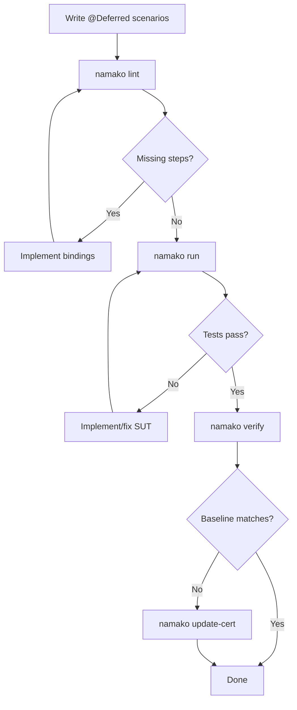

# NEXT_STEPS.md — Strategic Development Process for Spec-Driven AI Development

**Created:** 2026-01-19
**Updated:** 2026-01-20
**Author:** Architecture Review
**Purpose:** Define the optimal path forward for using Namako + Tesaki to drive autonomous spec-driven development

---

## Executive Assessment

### Where We Are

**Namako v1 is COMPLETE.** The toolchain is fully operational:

- ✅ 31 scenarios passing across 16 feature files
- ✅ All CLI commands implemented (`lint`, `verify`, `update-cert`, `status`, `review`, `explain`)
- ✅ Tesaki orchestrator generates deterministic NEXT_TASK.md
- ✅ CI gates green (namako_ci.sh, determinism_check.sh)
- ✅ All Bootstrap Exit Criteria satisfied

### What's Next: CONSUMPTION Mode Activation

**Namako v1.5 is COMPLETE.** All AI-enablement features have been implemented. The next step is to transition to CONSUMPTION mode and begin using the toolchain to develop Naia.

**Safety check before CONSUMPTION:** Ensure `@Stub` scenarios are excluded from promotion candidates and Tesaki task selection (see Phase 0.5 below).

---

## Phase 0: Namako v1.5 — AI-Enablement Features (COMPLETE)

**Goal:** Implement the v1.5 feature set defined in GOLD_PLAN.md §10.5 to enable robust AI-driven development. **ACHIEVED.**

### v1.5 Feature Set

| Feature | GOLD_PLAN Section | Priority | Status |
|---------|-------------------|----------|--------|
| Explicit ID tags (@Feature/@Rule_nn/@Scenario_nn) | §10.5.1 | HIGH | ✅ **COMPLETE** |
| Orphan binding hard error + `namako stub` | §10.5.2 | HIGH | ✅ **COMPLETE** |
| `namako review` coverage enhancements | §10.5.3 | HIGH | ✅ **COMPLETE** |
| Scenario fidelity packets (`namako explain`) | §10.5.4 | MEDIUM | ✅ **COMPLETE** |
| Machine-readable process state (`namako status --json`) | §10.5.5 | HIGH | ✅ **COMPLETE** |
| Rich `namako status` diffs | §10.5.6 | MEDIUM | ✅ **COMPLETE** |

### Implementation Order (Recommended)

#### Sprint 1: Foundation — Explicit ID Tags ✅ **COMPLETE**
**Duration:** 2-3 days → Completed 2026-01-19

1. ✅ **Update Gherkin parsing** to recognize `@Feature(name)`, `@Rule_nn`, `@Scenario_nn` tags
2. ✅ **Modify scenario_key derivation** to use `Feature:Rule_nn:Scenario_nn` format
3. ✅ **Add validation** for missing/duplicate IDs
4. ✅ **Migrate existing feature files** to use explicit IDs
5. ⏳ **Update certification** (run `update-cert`) — Scheduled for next phase

**Files to modify:**
- `namako/src/engine.rs` — scenario key derivation
- `namako/src/npap.rs` — key format changes
- `naia/test/specs/features/*.feature` — add ID tags

#### Sprint 2: Hygiene — Orphan Binding Enforcement ✅ **COMPLETE**
**Duration:** 1-2 days → Completed 2026-01-19

1. ✅ **Enhance lint** to detect orphan bindings
2. ✅ **Change warning → hard error** for orphans
3. ✅ **Implement `namako stub`** command
4. ✅ **Update tests** to verify orphan detection

**Files modified:**
- `namako/cli/src/lint.rs` — orphan detection as hard error
- `namako/cli/src/main.rs` — added `stub` subcommand
- `namako/cli/src/stub.rs` — new command implementation
- `namako/src/engine.rs` — @Deferred scenario binding tracking

#### Sprint 3: AI Packets — Enhanced Review ✅ **COMPLETE**
**Duration:** 2-3 days → Completed 2026-01-19

1. ✅ **Expand `namako review`** output with all 5 sections:
   - Coverage summary
   - Deferred items with blocker classification
   - Promotion candidates with reuse_score
   - Missing bindings worklist
   - Harness gaps

2. ✅ **Ensure deterministic output** (sorted, stable)

**Files modified:**
- `namako/cli/src/review.rs` — added DeferredScenarioItem, HarnessGap structs, all 5 sections

#### Sprint 4: AI Packets — Explain & Status ✅ **COMPLETE**
**Duration:** 2-3 days → Completed 2026-01-19

1. ✅ **Enhance `namako explain`** with full fidelity packet
2. ✅ **Enhance `namako status --json`** with all required fields
3. ✅ **Add rich text diff output** to `namako status`

**Files modified:**
- `namako/cli/src/explain.rs` — ExplainStep with binding_expression/source_location
- `namako/cli/src/status.rs` — StatusValue enum, IdentitySection struct, rich diffs

### v1.5 Definition of Done

| Criterion | Verification |
|-----------|--------------|
| Explicit IDs enforced | `namako lint` fails if @Feature/@Rule_nn/@Scenario_nn missing |
| Orphan → hard error | `namako lint` fails on orphan bindings |
| `namako stub` works | Can generate stub scenarios for orphans |
| Review packets complete | All 5 sections present in JSON output |
| Explain packets complete | Full fidelity packet for any scenario |
| Status JSON complete | All required fields present |
| Rich diffs work | Text output shows clear diagnostics |
| Feature files migrated | All 16 feature files have explicit ID tags |
| Gates green | namako_ci.sh, determinism_check.sh pass |

---

## Phase 1: Consumption Mode Activation (After v1.5)

**Goal:** After v1.5 is complete, formally transition from BOOTSTRAP to CONSUMPTION mode and validate the end-to-end workflow with a controlled first mission.

#### Step 1.1: Mode Transition
1. Update `CURRENT_STATUS.md`: Set `MODE: CONSUMPTION`
2. Commit the transition as a clear milestone marker

#### Step 1.2: First CONSUMPTION Mission (Controlled)
Per GOLD_PLAN §2.7, select ONE CORE scenario to validate the workflow:

**Recommended First Mission Options:**
1. **Connection lifecycle edge case** — A well-bounded scenario in `01_connection_lifecycle.feature`
2. **Entity replication scenario** — Start fleshing out `07_entity_replication.feature`
3. **User-initiated error handling** — Add explicit Result::Err scenarios per `00_common.feature` Rule

**Mission Template:**
```
1. Select ONE scenario from feature files (or write a new @Deferred one)
2. Define minimal observable contract (what must become testable)
3. Run through Tesaki FSM:
   - namako lint (resolve steps)
   - Implement missing bindings
   - namako run (execute)
   - namako verify (certify)
   - namako update-cert (if approved)
4. Keep scope minimal — one scenario, one mission
```

#### Step 1.3: Validate Autonomous Loop
Run `tesaki next` with `--max-cert-updates 3` to verify:
- Promotion candidate selection works
- Binding bundle suggestions are useful
- NEXT_TASK.md provides actionable instructions

---

## Phase 2: Specification Expansion (Short-term)

**Goal:** Build out the Naia feature specifications incrementally, using the Tesaki loop to drive implementation.

#### Priority Order for Specification Work

| Priority | Feature File | Current State | Recommended Action |
|----------|--------------|---------------|-------------------|
| 1 | `01_connection_lifecycle.feature` | 14 scenarios | Expand edge cases, error handling |
| 2 | `00_common.feature` | 8 scenarios | Add Result::Err scenarios |
| 3 | `smoke.feature` | 9 scenarios | Baseline functional tests |
| 4 | `07_entity_replication.feature` | 0 scenarios | Write core replication specs |
| 5 | `06_entity_scopes.feature` | 0 scenarios | Write scope management specs |
| 6 | `08_entity_ownership.feature` | 0 scenarios | Write ownership transfer specs |

#### Workflow Per Feature



#### Incremental Expansion Strategy

1. **Start with @Deferred** — Write scenarios tagged `@Deferred` for new functionality
2. **Promote in small batches** — Untag 1-3 scenarios at a time
3. **Keep CI green** — Never break the gate between promotions
4. **Use Tesaki guidance** — Let `tesaki next` suggest what to work on

---

## Phase 3: Harness Maturation (Medium-term)

**Goal:** Strengthen the test harness to support more complex scenarios.

#### Harness Enhancements Needed

| Enhancement | Purpose | Complexity |
|-------------|---------|------------|
| Multi-client scenarios | Test N-client interactions | Medium |
| Timing control | Deterministic tick advancement | Low |
| State inspection | Rich assertion helpers | Low |
| Error injection | Test failure paths | Medium |
| Performance baselines | Non-functional requirements | High |

#### Implementation Pattern

For each harness enhancement:
1. Write a `.feature` scenario that requires the enhancement
2. Mark it `@Deferred @Blocker(HARNESS_ONLY)`
3. Implement harness capability
4. Promote scenario
5. Iterate

---

## Phase 4: V2+ Toolchain Polish (Long-term)

**Goal:** Address remaining v2+ features that provide additional value beyond v1.5.

#### V2+ Features (Deferred Beyond v1.5)

| Feature | GOLD_PLAN Section | Value | Status |
|---------|-------------------|-------|--------|
| FeatureAstNorm | §11.1 | Cosmetic-change immunity | ⏳ Deferred |
| CBOR encoding | §11.7 | Cross-platform byte reproducibility | ⏳ Deferred |
| Conformance fixtures | §11.8 | Regression safety | ⏳ Deferred |
| `resolution_semantics_id` | §11.9 | Version-tracked resolution changes | ⏳ Deferred |
| `bindings_used_hash` | §11.12 | Fast-path verification | ⏳ Deferred |
| Multi-language support | §11.13 | Non-Rust adapters | ⏳ Deferred |
| Adapter SDKs | §11.14 | JS/TS, Python, Go support | ⏳ Deferred |
| Cross-language hashing | §11.15 | Hash oracle / native SDK | ⏳ Deferred |
| Adapter certification | §11.16 | Third-party adapter verification | ⏳ Deferred |

**Recommendation:** These features are not needed for autonomous Naia development. Defer until publish-grade requirements emerge.

---

## Immediate Action Checklist

### For Connor (Human Operator)

- [ ] Review changes from TODO.md execution (see OUTPUT.md)
- [ ] Commit all changes (namako and naia repos)
- [ ] Run `namako update-cert` to establish new baseline (hashes changed due to source_symbol)
- [ ] Update `CURRENT_STATUS.md`: Set `MODE: CONSUMPTION`
- [ ] Select first CONSUMPTION mission target

### For AI Agent (Pre-CONSUMPTION Safety Check) — COMPLETE

**@Stub exclusion verified (2026-01-20):**
1. ✅ `namako review` excludes `@Stub` scenarios from promotion candidates
2. ✅ Tesaki filters `@Stub` scenarios (defense-in-depth)
3. ✅ Unit tests added for stub exclusion logic
4. ✅ Smoke test: 0 promotion candidates (5 stubs correctly excluded)

### For AI Agent (CONSUMPTION Mode)

Once MODE = CONSUMPTION:
1. Run `tesaki next` to get current task
2. If no promotion candidates, suggest new @Deferred scenarios
3. Implement bindings for promoted scenarios
4. Iterate until gates green
5. Request update-cert approval when stable

---

## Success Metrics

### v1.5 Completion — ACHIEVED

| Metric | Target | Status |
|--------|--------|--------|
| Explicit ID tags | All 17 feature files have @Feature/@Rule_nn/@Scenario_nn | ✅ DONE |
| Orphan enforcement | `namako lint` fails on orphans | ✅ DONE |
| Review packets | All 5 sections implemented | ✅ DONE |
| Explain packets | Full fidelity output with source_symbol | ✅ DONE |
| Status enhancements | JSON + rich diffs complete | ✅ DONE |
| Stub exclusion | @Stub scenarios excluded from promotion | ✅ DONE |
| Gates | All green | ✅ DONE |

### Short-term (Next 2-4 Weeks, Post-v1.5)

| Metric | Target |
|--------|--------|
| MODE | CONSUMPTION |
| Executable scenarios | 50+ (from 31) |
| Feature files with scenarios | 8+ (from 3) |
| Autonomous tesaki cycles completed | 10+ |

### Medium-term (Next 2 Months)

| Metric | Target |
|--------|--------|
| Executable scenarios | 100+ |
| Feature coverage | All 16 feature files have scenarios |
| CORE blockers resolved | 5+ |

### Long-term (6 Months)

| Metric | Target |
|--------|--------|
| Naia core behaviors specified | 80%+ |
| CI cycle time | < 5 minutes |
| Agent autonomy | Tesaki can complete missions with minimal human intervention |

---

## Risk Mitigation

### Risk: Specification Drift
**Mitigation:** All specs in `.feature` files are normative. Markdown docs are reference only.

### Risk: Binding Proliferation
**Mitigation:** Regular orphan checks (`namako review` flags unused bindings).

### Risk: Hash Contract Changes
**Mitigation:** `hash_contract_version` enables controlled migrations. Never modify hashing rules without version bump.

### Risk: Agent Edit Surface Violations
**Mitigation:** `SYSTEM.md` enforces BOOTSTRAP/CONSUMPTION boundaries. Violations require revert + incident log.

### Risk: Certification Baseline Corruption
**Mitigation:**
- `update-cert` has refusal rules (must pass verify first)
- Tesaki governance (`--max-cert-updates`) limits autonomous updates
- Audit log tracks all baseline changes

---

## Conclusion

The Namako v1.5 toolchain is **COMPLETE and ready for CONSUMPTION mode**. All AI-enablement features have been implemented:

1. **Explicit ID tags** — ✅ Refactor-stable identity for all specs
2. **Orphan enforcement** — ✅ Clean binding registry with `namako stub`
3. **Enhanced packets** — ✅ Rich work items for AI task selection
4. **Fidelity packets** — ✅ AI-assisted spec review with source_symbol
5. **Rich status** — ✅ Better debugging and automation
6. **Stub exclusion** — ✅ @Stub scenarios cannot be selected as tasks

**Next step:** Connor reviews changes, runs `namako update-cert`, sets MODE: CONSUMPTION, and selects first mission target. The Tesaki FSM is ready to drive autonomous AI-driven development of Naia.

---

*End of NEXT_STEPS.md*
