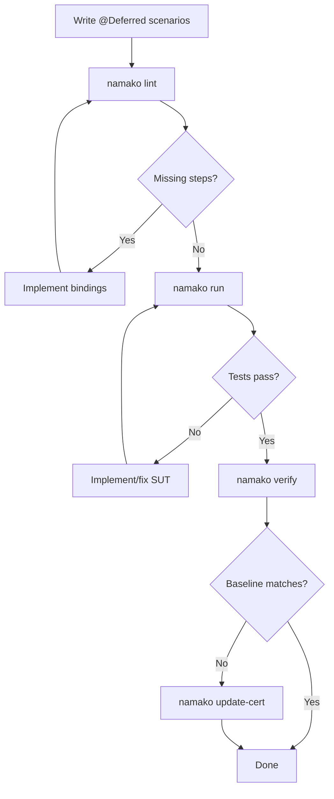

# NEXT_STEPS.md — Strategic Development Process for Spec-Driven AI Development

**Created:** 2026-01-19
**Updated:** 2026-01-20
**Author:** Architecture Review
**Purpose:** Define the optimal path forward for using Namako + Tesaki to drive autonomous spec-driven development

---

## Phase 0: v1.7 Runner Integration — ✅ COMPLETE

**Goal:** Implement Tesaki ↔ coding-agent integration so that `tesaki run` becomes the single-command autonomous development loop.

**Status:** COMPLETE. Implementation lives in `tesaki/src/` modules: `mission.rs`, `runner.rs`, `workspace.rs`, `stop_reason.rs`.

**Single-command UX:** `tesaki run` is the implemented entrypoint. Users run it repeatedly; Tesaki handles measurement, task selection, runner invocation, and validation internally.

### Implementation Steps — All Complete

| Step | Component | Description | Status |
|------|-----------|-------------|--------|
| 0.1 | Mission Bundle | `.tesaki/missions/<id>/` directory structure | ✅ `mission.rs` |
| 0.2 | Runner Trait | `Runner` trait/abstraction in Tesaki | ✅ `runner.rs` |
| 0.3 | Claude Code Backend | First runner backend | ✅ `ClaudeCodeRunner` |
| 0.4 | `tesaki run` Command | Single-command entrypoint | ✅ `main.rs` |
| 0.5 | Stop Conditions | DONE/BLOCKED/BUDGET/etc. detection | ✅ `stop_reason.rs` |
| 0.6 | Gate Classification | GateOutcome + UpdateCertInvoker | ✅ `gate.rs` |
| 0.7 | Update-Cert Governance | Auto update-cert for verify-only failures | ✅ `main.rs` |
| 0.8 | Retry Logic | Retry loop for retryable failures | ✅ `stop_reason.rs` + `main.rs` |
| 0.9 | End-to-End Test | Verify full loop with controlled mission | ✅ 48 tests |

### Exit Criteria for Phase 0 — All Satisfied

- [x] `tesaki run` executes a mission bundle via Claude Code backend
- [x] `namako gate --json` validates runner output
- [x] Stop conditions emit structured reasons
- [x] At least one successful autonomous mission cycle demonstrated (mock-backed)
- [x] Update-cert governance: only FailVerifyOnly triggers update-cert, bounded by `--max-cert-updates`
- [x] Retry logic: only retryable failures retry, bounded by `--max-retries`
- [x] 48 unit tests covering gate classification, governance, and retry logic

---

## Phase 1: Consumption Mode Activation (After v1.7)

**Goal:** Formally transition from BOOTSTRAP to CONSUMPTION mode and validate the end-to-end workflow with a controlled first mission.

**Prerequisite:** Phase 0 (v1.7 Runner Integration) must be complete and verified.

**Safety check before CONSUMPTION:** Ensure `@Stub` scenarios are excluded from promotion candidates and Tesaki task selection.

#### Step 1.1: Mode Transition
1. Update `CURRENT_STATUS.md`: Set `MODE: CONSUMPTION`
2. Commit the transition as a clear milestone marker

#### Step 1.2: First CONSUMPTION Mission (Controlled)
Per GOLD_PLAN §2.7, select ONE CORE scenario to validate the workflow:

**Recommended First Mission Options:**
1. **Connection lifecycle edge case** — A well-bounded scenario in `01_connection_lifecycle.feature`
2. **Entity replication scenario** — Start fleshing out `07_entity_replication.feature`
3. **User-initiated error handling** — Add explicit Result::Err scenarios per `00_common.feature` Rule

**Mission Template:**
```
1. Select ONE scenario from feature files (or write a new @Deferred one)
2. Define minimal observable contract (what must become testable)
3. Run through `tesaki run`:
   - Tesaki runs namako gate, selects task, creates mission bundle
   - Runner executes mission
   - Tesaki validates via namako gate
   - Tesaki handles update-cert (with governance limits)
4. Keep scope minimal — one scenario, one mission
```

#### Step 1.3: Validate Autonomous Loop
Run `tesaki run` to verify:
- Mission bundle generation works
- Runner executes successfully
- Gate validation catches regressions
- Stop conditions trigger appropriately

---

## Phase 2: Specification Expansion (Short-term)

**Goal:** Build out the Naia feature specifications incrementally, using the Tesaki loop to drive implementation.

#### Priority Order for Specification Work

| Priority | Feature File | Current State | Recommended Action |
|----------|--------------|---------------|-------------------|
| 1 | `01_connection_lifecycle.feature` | 14 scenarios | Expand edge cases, error handling |
| 2 | `00_common.feature` | 8 scenarios | Add Result::Err scenarios |
| 3 | `smoke.feature` | 9 scenarios | Baseline functional tests |
| 4 | `07_entity_replication.feature` | 0 scenarios | Write core replication specs |
| 5 | `06_entity_scopes.feature` | 0 scenarios | Write scope management specs |
| 6 | `08_entity_ownership.feature` | 0 scenarios | Write ownership transfer specs |

#### Workflow Per Feature



#### Incremental Expansion Strategy

1. **Start with @Deferred** — Write scenarios tagged `@Deferred` for new functionality
2. **Promote in small batches** — Untag 1-3 scenarios at a time
3. **Keep CI green** — Never break the gate between promotions
4. **Use Tesaki guidance** — Let `tesaki run` drive the development loop

---

## Phase 3: Harness Maturation (Medium-term)

**Goal:** Strengthen the test harness to support more complex scenarios.

#### Harness Enhancements Needed

| Enhancement | Purpose | Complexity |
|-------------|---------|------------|
| Multi-client scenarios | Test N-client interactions | Medium |
| Timing control | Deterministic tick advancement | Low |
| State inspection | Rich assertion helpers | Low |
| Error injection | Test failure paths | Medium |
| Performance baselines | Non-functional requirements | High |

#### Implementation Pattern

For each harness enhancement:
1. Write a `.feature` scenario that requires the enhancement
2. Mark it `@Deferred @Blocker(HARNESS_ONLY)`
3. Implement harness capability
4. Promote scenario
5. Iterate

---

## Phase 4: V2+ Toolchain Polish (Long-term)

**Goal:** Address remaining v2+ features that provide additional value beyond v1.5.

#### V2+ Features (Deferred Beyond v1.5)

| Feature | GOLD_PLAN Section | Value | Status |
|---------|-------------------|-------|--------|
| FeatureAstNorm | §11.1 | Cosmetic-change immunity | Deferred |
| CBOR encoding | §11.7 | Cross-platform byte reproducibility | Deferred |
| Conformance fixtures | §11.8 | Regression safety | Deferred |
| `resolution_semantics_id` | §11.9 | Version-tracked resolution changes | Deferred |
| `bindings_used_hash` | §11.12 | Fast-path verification | Deferred |
| Multi-language support | §11.13 | Non-Rust adapters | Deferred |
| Adapter SDKs | §11.14 | JS/TS, Python, Go support | Deferred |
| Cross-language hashing | §11.15 | Hash oracle / native SDK | Deferred |
| Adapter certification | §11.16 | Third-party adapter verification | Deferred |

**Recommendation:** These features are not needed for autonomous Naia development. Defer until publish-grade requirements emerge.

---

## Immediate Action Checklist

### For Connor (Human Operator)

- [ ] Review changes from TODO.md execution (see OUTPUT.md)
- [ ] Commit all changes (namako and naia repos)
- [ ] Run `namako update-cert` to establish new baseline if needed

### For AI Agent (BOOTSTRAP Mode — v1.7 Complete)

**v1.7 Runner Integration is COMPLETE.** All components implemented:

- ✅ Mission Bundle directory structure (`tesaki/src/mission.rs`)
- ✅ Runner trait abstraction (`tesaki/src/runner.rs`)
- ✅ Claude Code runner backend (`ClaudeCodeRunner`)
- ✅ `tesaki run` command (`tesaki/src/main.rs`)
- ✅ Stop condition detection (`tesaki/src/stop_reason.rs`)
- ✅ End-to-end tests (23 tests passing)

**Next priority:** Transition to CONSUMPTION mode (Phase 1)

**v1.7 Follow-up Implementation (2026-01-20):**
- Gate outcome classification (`gate.rs`): Pass, FailVerifyOnly, FailOther
- Update-cert governance: Only FailVerifyOnly outcomes trigger update-cert
- Retry logic: Only RunnerFailed, NoProgress, GateFailed are retryable
- 48 tests now passing (up from 23)

### For AI Agent (After v1.7 — CONSUMPTION Mode)

Once v1.7 is verified and MODE = CONSUMPTION:
1. Run `tesaki run` to execute autonomous development loop
2. If no promotion candidates, suggest new @Deferred scenarios
3. Let Tesaki drive the loop (mission → gate → validate → repeat)
4. Tesaki handles update-cert within governance limits

---

## Success Metrics

### Short-term (Next 2-4 Weeks)

| Metric | Target |
|--------|--------|
| MODE | CONSUMPTION |
| Executable scenarios | 50+ (from 31) |
| Feature files with scenarios | 8+ (from 3) |
| Autonomous tesaki cycles completed | 10+ |

### Medium-term (Next 2 Months)

| Metric | Target |
|--------|--------|
| Executable scenarios | 100+ |
| Feature coverage | All 16 feature files have scenarios |
| CORE blockers resolved | 5+ |

### Long-term (6 Months)

| Metric | Target |
|--------|--------|
| Naia core behaviors specified | 80%+ |
| CI cycle time | < 5 minutes |
| Agent autonomy | Tesaki can complete missions with minimal human intervention |

---

## Risk Mitigation

### Risk: Specification Drift
**Mitigation:** All specs in `.feature` files are normative. Markdown docs are reference only.

### Risk: Binding Proliferation
**Mitigation:** Regular orphan checks (`namako review` flags unused bindings).

### Risk: Hash Contract Changes
**Mitigation:** `hash_contract_version` enables controlled migrations. Never modify hashing rules without version bump.

### Risk: Agent Edit Surface Violations
**Mitigation:** `SYSTEM.md` enforces BOOTSTRAP/CONSUMPTION boundaries. Violations require revert + incident log.

### Risk: Certification Baseline Corruption
**Mitigation:**
- `update-cert` has refusal rules (must pass verify first)
- Tesaki governance (`--max-cert-updates`) limits autonomous updates
- Audit log tracks all baseline changes

---

*End of NEXT_STEPS.md*
